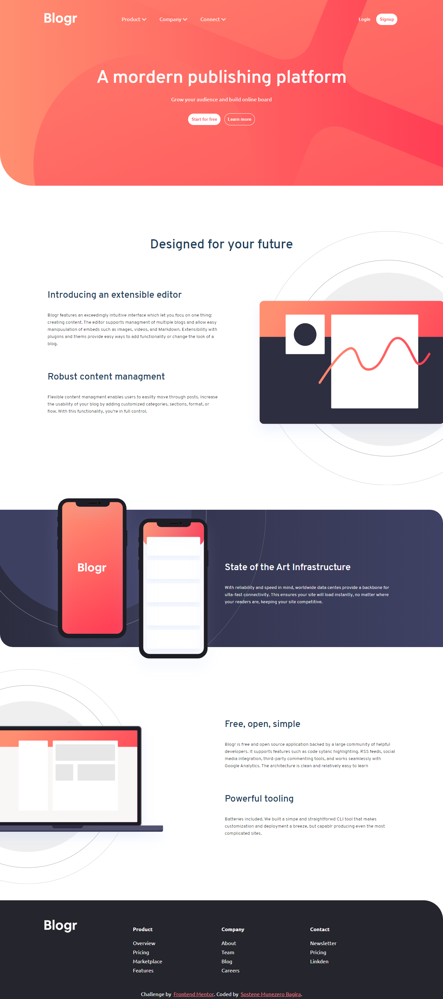

# Frontend Mentor - Blogr landing page solution

This is a solution to the [Blogr landing page challenge on Frontend Mentor](https://www.frontendmentor.io/challenges/blogr-landing-page-EX2RLAApP). Frontend Mentor challenges help you improve your coding skills by building realistic projects.

## Table of contents

- [Overview](#overview)
  - [The challenge](#the-challenge)
  - [Screenshot](#screenshot)
  - [Links](#links)
- [My process](#my-process)
  - [Built with](#built-with)
  - [What I learned](#what-i-learned)
- [Author](#author)

## Overview

Blogr is challenge by Frontend mentor to test and help you to improve you coding skill. Solved it using HTML and CSS, and vanilla javascript.

### The challenge

Users should be able to:

- View the optimal layout for the site depending on their device's screen size
- See hover states for all interactive elements on the page

### Screenshot



### Links

- Solution URL: [Github repository](https://www.github.com/sos10e/blogr)
- Live Site URL: [Github page](https://sos10e.github.io/blogr)

## My process

I have decided to use the css flex to accomplish most of my work

### Built with

- Semantic HTML5 markup
- CSS custom properties
- Flexbox
- CSS Grid
- Vanilla javascript

### What I learned

I have been challenged by position the images while overlapping the the container, some times it was not responsive. Additional I am feeling comfortable with building multiple background using css efficiently. Last, I also became mor comfortable with css variables.

Multiple background as follows:

```css
background: url(../images/bg-pattern-intro.svg) no-repeat 30% 50%/ 200%, linear-gradient(
    90deg,
    var(--gradient-light-red),
    var(--gradient-red)
  );
```

## Author

About author

- Website - [Sosetene profile webpage](https://sos10e.github.io)
- Frontend Mentor - [Sos10e](https://www.frontendmentor.io/profile/sos10e)
- Twitter - [SosteneMunezero](https://twitter.com/SosteneMunezero)
- Github - [sos10e](https://www.github.com/sos10e)
